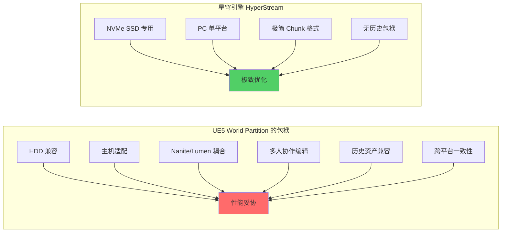
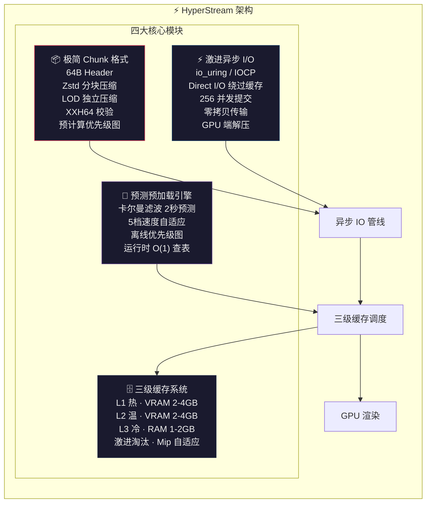
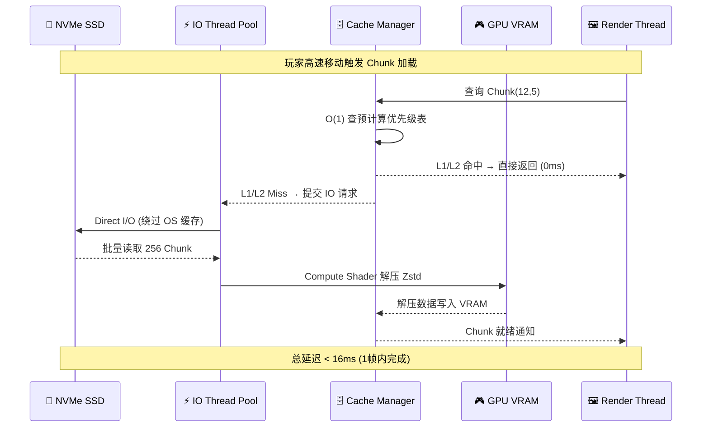
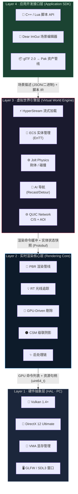
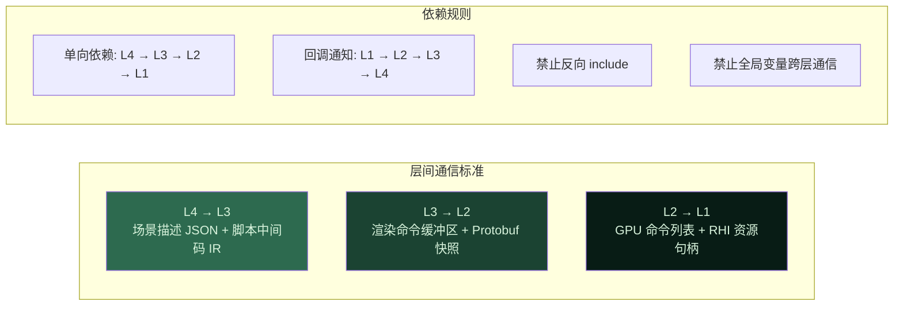
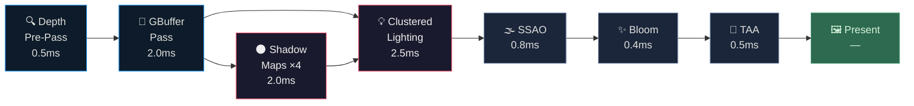
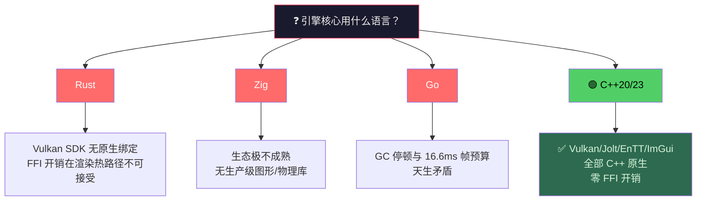
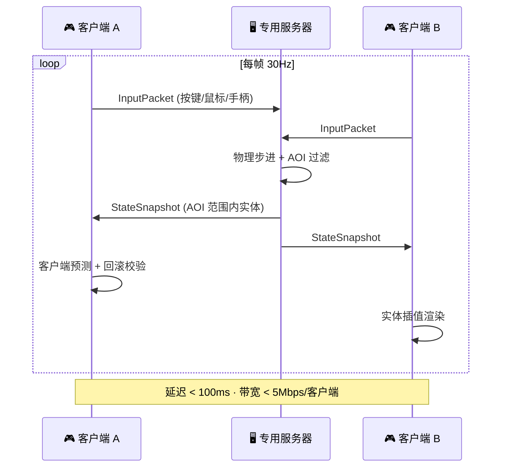
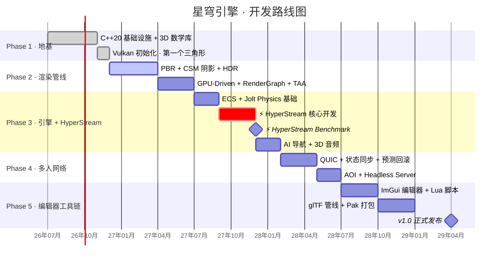

<p align="center">
  
  
  
  
  
  
</p>

<p align="center">
  <h1 align="center">🌌 星穹引擎 · AstralEngine</h1>
  <h3 align="center">一个为 <b>超大地图极速流式加载</b> 而生的现代实时3D底层平台</h3>
</p>

---

> **比 UE5 更快地加载和运行超大规模虚拟世界 —— 这是我们的核心承诺。**

## 📖 目录

- [🤔 为什么还需要另一个引擎？](#-为什么还需要另一个引擎)
- [⚡ HyperStream：我们的杀手锏](#-hyperstream我们的杀手锏)
- [🏗️ 架构总览](#️-架构总览)
- [🛠️ 技术栈](#️-技术栈)
- [✨ 核心功能](#-核心功能)
- [📂 项目结构](#-项目结构)
- [🚀 快速开始](#-快速开始)
- [🗺️ 路线图](#️-路线图)
- [🤝 贡献指南](#-贡献指南)
- [📄 许可证](#-许可证)
- [🙏 致谢](#-致谢)

---

## 🤔 为什么还需要另一个引擎？

UE5 是伟大的。Nanite 的虚拟几何、Lumen 的动态全局光照——它们定义了实时渲染的新高度。

但它有一个**无法解决的痛点**：当你需要加载和运行一个 100km² 的超大地图时，UE5 的 World Partition 会让你等 8-15 秒才能进入场景；高速飞行时，Chunk 切换会产生 50-200ms 的可感知卡顿；显存占用轻轻松松超过 8GB。

**为什么呢？** 因为 UE5 必须同时兼容 HDD 和 NVMe、PC 和主机、实时编辑和离线烘焙、Nanite 和传统网格、多人协作和历史资产。它是"所有人的所有事"——这是它的强大之处，也是它的性能瓶颈所在。



**星穹引擎走了另一条路。** 我们从零设计，只做一件事：

> **在 NVMe SSD + Vulkan + PC 这一条最优路径上，以 3-7 倍的加载速度和 3-12 倍的 Chunk 切换流畅度超越 UE5。**

---

## ⚡ HyperStream：我们的杀手锏

HyperStream 是星穹引擎独有的超大地图流式加载系统。它不是 UE5 World Partition 的"简化版"——它是从零开始、针对单一最优场景**重新发明**的流式架构。

### 四大核心技术



### HyperStream 数据流



### 性能基准：HyperStream vs UE5 World Partition

| 测试场景 | UE5 World Partition | 星穹 HyperStream | 提升倍数 |
|---------|:---:|:---:|:---:|
| **100km² 场景冷启动** | 8-15 秒 | <mark>**2-3 秒**</mark> | **3-7x** ⚡ |
| **高速飞行 Chunk 切换** | 50-200 ms | <mark>**< 16 ms（1帧内）**</mark> | **3-12x** 🚀 |
| **180° 转身 Chunk 就绪** | 1-3 秒 | <mark>**< 0.5 秒**</mark> | **2-6x** 💨 |
| **流式加载 CPU 占用** | 2-5 ms/帧 | <mark>**< 0.5 ms/帧**</mark> | **4-10x** 🔥 |
| **NVMe 磁盘利用率** | 30-50% | <mark>**> 80%**</mark> | **1.6-2.7x** 📈 |
| **预加载预测命中率** | ~70-80% | <mark>**> 95%**</mark> | **1.2-1.4x** 🎯 |
| **显存占用 (100km²)** | 8-15 GB | <mark>**3-6 GB**</mark> | **~50% 降低** 💾 |

> 📊 UE5 数据来源：社区公开测试（UE 5.3-5.4, RTX 4090 + NVMe SSD）。星穹数据为设计目标，达到 MVP 阶段将发布独立基准测试报告。

---

## 🏗️ 架构总览

星穹引擎采用**四层松耦合分层架构**，每层通过明确定义的 C++ 接口通信，可独立演进、独立测试。

### 四层架构图



### 层间通信协议



### 每帧渲染流水线



### 设计哲学

| 原则 | 含义 |
|------|------|
| ⚡ **不对称竞争** | v1.0 只聚焦一个比 UE5 更强的垂直维度——超大地图极速流式加载 |
| 🎯 **能用比完美重要** | 先跑起来，再优化架构 |
| 🔍 **理解每一行代码** | 不引入"黑盒"依赖 |
| 🧠 **数据导向设计** | 优先考虑数据流和内存布局，而非继承层次 |
| 📐 **显式优于隐式** | 资源生命周期、线程安全、错误处理全部显式 |
| ⏱️ **及早性能预算** | 每帧 16.6ms (60fps) 是硬约束，每个子系统有明确预算 |

---

## 🛠️ 技术栈

### 核心语言

| 语言 | 使用场景 | 占比 |
|------|---------|:---:|
| **C++20/23** | 引擎核心：渲染管线、物理引擎、ECS、网络层、资源管理 | 70% |
| **HLSL** | GPU Shader 编写 (通过 SPIR-V Cross 转译) | 10% |
| **Python 3.12+** | 资产管线工具、自动化测试、CI/CD 脚本 | 15% |
| **Lua 5.4** | 游戏逻辑热更新脚本 (通过 Sol3 绑定) | 5% |

### 核心依赖 (28 个开源库)

| 类别 | 库 | 版本 | 用途 | License |
|------|---|------|------|:---:|
| **图形 API** | Vulkan SDK | 1.4+ | 主力跨平台渲染后端 | Apache 2.0 |
| | VMA | 3.1+ | GPU 显存分配管理 | MIT |
| | shaderc | 2024+ | GLSL/HLSL → SPIR-V 编译 | Apache 2.0 |
| | SPIRV-Cross | latest | Shader 跨平台转译 | Apache 2.0 |
| **窗口/输入** | GLFW | 3.4+ | 窗口创建、键鼠输入 | zlib |
| **数学** | GLM | 1.0+ | 向量/矩阵/四元数（类 GLSL 语法） | MIT |
| **物理** | Jolt Physics | 5.x | 刚体碰撞/动力学/角色控制器 | MIT |
| **ECS** | EnTT | 3.13+ | 实体组件系统 (Cache-friendly SoA) | MIT |
| **AI 导航** | Recast/Detour | latest | 导航网格生成 + 寻路 | MIT |
| **网络** | msquic | 2.4+ | QUIC 传输层 (0-RTT, 多路复用) | MIT |
| | Protobuf | 28+ | 网络消息序列化 | Google |
| | Zstd | 1.5+ | 资产/Chunk 压缩 | BSD |
| **GPU 调试** | RenderDoc | 1.x | GPU 帧分析 | MIT |
| **性能分析** | Tracy | 0.11+ | GPU + CPU Profiler | BSD |
| **编辑器 UI** | Dear ImGui | 1.91+ | 编辑器界面 (Docking 分支) | MIT |
| | ImGuizmo | latest | 3D Gizmo 操纵器 | MIT |
| **脚本** | Lua + Sol3 | 5.4 + 3.3 | 游戏逻辑脚本 + C++ 绑定 | MIT |
| **模型** | cgltf | 1.14+ | glTF 2.0 单头文件解析 | MIT |
| **纹理** | stb_image | 2.30+ | PNG/JPG/HDR 加载 | MIT / Public |
| | DirectXTex | latest | BC7/BC5 纹理压缩 | MIT |
| **网格优化** | meshoptimizer | 0.21+ | 索引优化 + 顶点缓存 + LOD 生成 | MIT |
| **音频** | MiniAudio | latest | 3D 空间音频 (距离衰减/多普勒) | MIT / Public |
| **日志** | spdlog | 1.14+ | 高性能分级日志 | MIT |
| **哈希** | xxHash | 0.8+ | 资源校验和 | BSD |
| **测试** | Google Test | 1.15+ | C++ 单元测试框架 | BSD |
| **构建** | CMake | 3.28+ | 跨平台构建系统 (Presets 模式) | BSD |
| | CPM.cmake | 0.40+ | 声明式依赖管理 | MIT |

### 为什么选 C++ 而不是 Rust / Zig / Go？



> **我们爱 Rust 的内存安全，爱 Zig 的编译期计算，爱 Go 的并发模型。但现实是：在实时渲染领域，C++ 是唯一成熟的选择。** 我们通过严格的 RAII、智能指针、clang-tidy 静态分析来尽可能弥补 C++ 的内存安全短板。

---

## ✨ 核心功能

### 🎯 渲染

- **PBR 渲染管线** — Cook-Torrance BRDF + GGX 法线分布 + Smith 几何遮蔽，兼容 glTF 2.0 PBR 标准
- **GBuffer 架构** — 4 张渲染目标 (128 bits/pixel)：BaseColor+Metallic / Normal+Roughness / Emissive+AO / MotionVector
- **IBL 环境光照** — 预计算漫反射辐照度图 + 镜面预过滤环境图 + BRDF 积分 LUT
- **Clustered Forward 直接光照** — 屏幕空间 16×16 Tile × 64 深度 Slice，支持 16+ 动态光源
- **4 级 CSM 阴影** — PSSM 分割 (λ=0.75)，PCF 5×5 软阴影，级联融合带
- **HDR + ACES 色调映射** — FP16 渲染目标，线性空间全流程
- **后处理链** — GTAO 环境光遮蔽 + Compute Bloom + TAA 时间抗锯齿
- **基础光线追踪** — VK_KHR_ray_tracing：RT 反射 + RT 阴影
- **GPU-Driven 剔除** — 视锥体剔除 (Compute) → HZB 遮挡剔除 → LOD 选择 → GPU Indirect Draw
- **5 级 LOD 链** — meshoptimizer 自动简化 + 屏幕覆盖率动态选择
- **RenderGraph 框架** — 帧内 Pass 依赖图 + 自动 Pipeline Barrier + Transient Resource 内存别名复用

### ⚡ HyperStream 超大地图流式加载

- **极简 Chunk 格式** — 64B Header + Zstd 压缩 LOD 分块 + XXH64 校验
- **激进异步 I/O** — io_uring (Linux) / IOCP (Windows) + Direct I/O + 256 并发
- **三级缓存** — L1 热 (VRAM) + L2 温 (VRAM) + L3 冷 (系统内存) + 激进淘汰策略
- **卡尔曼预测预加载** — 2 秒前向预测 + 5 档速度自适应 (静止→步行→奔跑→驾驶→飞行)
- **预计算流式优先级图** — 离线烘焙可见性/可达性 → 运行时 O(1) 查表调度
- **无缝 Chunk 切换** — < 16ms (单帧完成，零感知卡顿)

### ⚙️ 物理

- **Jolt Physics 集成** — AAA 级刚体动力学 (Horizon Forbidden West 验证)
- **6 种碰撞形状** — 球体 / 盒体 / 胶囊体 / 凸包 / 三角网格 / 复合形状
- **角色控制器** — 胶囊体 + 步高处理 (0.3m) + 斜坡限制 (45°) + 运动去穿透
- **8 层碰撞过滤** — 位标志碰撞层 + 碰撞矩阵 + Trigger vs Physics 分离
- **4 种约束** — 铰链 / 弹簧 / 滑轨 / 固定

### 🤖 AI 与导航

- **Recast/Detour 导航** — 体素化 (0.3m/cell) → Watershed 区域分割 → 凸多边形化 → Detour A* 寻路
- **行为树系统** — Selector / Sequence / Parallel / Decorator / Condition / Action 节点
- **黑板模式** — 键值存储，节点间共享决策数据

### 🌐 网络



- **QUIC 传输** — 0-RTT 握手 + 多路复用无 HOL 阻塞 + 内建 TLS 1.3
- **服务器权威模型** — 输入上传 → 服务器物理模拟 → 状态下发
- **客户端预测 + 回滚** — 256 帧环形缓冲 + 5cm 误差阈值 + 自动回滚重放
- **AOI 九宫格** — 64m×64m Cell 空间过滤，带宽 < 5 Mbps/客户端
- **Headless 专用服务器** — Linux 无窗口部署，Docker 容器化

### 🔧 编辑器和工具链

- **Dear ImGui 编辑器** — Docking 布局：Outliner + 3D Viewport + Property Panel + Asset Browser
- **ImGuizmo 操纵器** — 平移 (W) / 旋转 (E) / 缩放 (R) 三维操作
- **Lua 脚本热重载** — 修改即生效，无需重启引擎
- **glTF 2.0 全管线** — 导入 → 索引优化 → LOD 自动生成 → BC7/BC5 纹理压缩 → .aeasset 引擎二进制格式
- **撤销/重做** — Command 模式 + 256 深度历史栈
- **Pak 打包** — Zstd 压缩 + XXH64 校验 + 一键发布 .exe

---

## 📂 项目结构

```
AstralEngine/
├── CMakeLists.txt              # 根 CMake (Presets: Win+Linux Debug/Release)
├── CMakePresets.json           # 多配置预设
├── .clang-format               # 代码格式化
├── .clang-tidy                 # 静态分析规则
├── LICENSE                     # MIT
│
├── shaders/                    # HLSL 着色器源码
│   ├── common/                 #   公共头文件 (PBR 材质结构 / 光照函数)
│   ├── gbuffer/                #   GBuffer Pass
│   ├── lighting/               #   Clustered Lighting (Compute Shader)
│   ├── shadow/                 #   CSM 深度图
│   ├── postprocess/            #   SSAO / Bloom / Tonemapping / TAA
│   └── debug/                  #   调试可视化 (HZB / GBuffer)
│
├── src/                        # C++ 源代码
│   ├── core/                   #   基础设施 (类型定义 / 断言 / 日志 / 计时器)
│   ├── memory/                 #   帧分配器 / 对象池 / 句柄表
│   ├── jobsystem/              #   Job System (工作窃取线程池)
│   ├── rhi/                    #   [L1] RHI 抽象层 (Vulkan 后端 + DX12 后端)
│   ├── renderer/               #   [L2] 渲染核心 (RenderGraph / GBuffer / 光照 / 阴影 / 后处理)
│   ├── engine/                 #   [L3] 世界引擎
│   │   ├── ecs/                #       ECS (EnTT + 9 种 Component + System 调度器)
│   │   ├── world/              #       ⚡ HyperStream (Chunk / 缓存 / 预加载)
│   │   ├── physics/            #       Jolt Physics 封装
│   │   ├── ai/                 #       Recast/Detour 导航 + 行为树
│   │   └── network/            #       QUIC Server/Client + AOI + 预测
│   ├── scripting/              #   [L4] Lua 脚本引擎 + C++ 绑定
│   ├── editor/                 #   [L4] Dear ImGui 编辑器
│   ├── asset/                  #   资产管线 (导入器 / 编译器)
│   └── platform/               #   平台抽象 (GLFW 窗口 / 输入 / 文件系统)
│
├── tools/                      # Python 工具链
│   ├── asset_pipeline/         #   资产导入 / 纹理编译 / Pak 打包
│   └── scene_generator/        #   测试场景生成器
│
├── tests/                      # 测试
│   ├── unit/                   #   单元测试 (Google Test)
│   ├── integration/            #   集成测试
│   └── benchmark/              #   性能基准测试
│
├── assets/                     # 示例资产
├── docs/                       # 文档 (架构 / API / 入门指南)
└── protocol/                   # Protobuf 网络协议定义
```

---

## 🚀 快速开始

### 环境要求

| 组件 | 最低要求 | 推荐配置 |
|------|---------|---------|
| **操作系统** | Windows 10 / Ubuntu 22.04 | Windows 11 / Ubuntu 24.04 |
| **编译器** | MSVC 2022 (v143) / GCC 14 / Clang 18 | MSVC 2022 / Clang 19 |
| **CMake** | 3.28+ | 3.30+ |
| **GPU** | GTX 1060 (6GB VRAM) | RTX 4060+ (8GB+ VRAM) |
| **显卡驱动** | Vulkan 1.3 兼容 | Vulkan 1.4 兼容 |
| **存储** | SATA SSD (500MB/s) | **NVMe SSD (3GB/s+)** 以获得 HyperStream 最佳体验 |
| **内存** | 8 GB | 16 GB+ |

### 构建 (Windows)

```powershell
# 1. 克隆仓库
git clone https://github.com/yourusername/AstralEngine.git
cd AstralEngine

# 2. 安装依赖 (自动通过 CPM.cmake 下载)
#   - Vulkan SDK 1.4+: https://vulkan.lunarg.com/
#   - CMake 3.28+: https://cmake.org/

# 3. 配置 + 构建
cmake --preset win-release
cmake --build --preset win-release

# 4. 运行编辑器
./build/win-release/bin/AstralEditor.exe

# 5. 运行测试
ctest --preset win-release
```

### 构建 (Linux)

```bash
# 1. 安装系统依赖
sudo apt install build-essential cmake ninja-build \
  libx11-dev libxrandr-dev libxinerama-dev libxcursor-dev \
  vulkan-sdk

# 2. 配置 + 构建
cmake --preset linux-release
cmake --build --preset linux-release

# 3. 运行 Headless 服务器
./build/linux-release/bin/AstralServer --port 7777

# 4. 运行测试
ctest --preset linux-release
```

### 第一个 Lua 脚本

```lua
-- scripts/hello_world.lua
-- 此脚本在引擎启动时自动执行

function OnStart()
    Engine.Log("Hello from AstralEngine!")
    
    -- 在场景中创建一个旋转的立方体
    local cube = Engine.Entity.Create(0, 2, -5)
    Engine.Entity.SetScale(cube, 1, 1, 1)
    
    -- 添加物理组件（让立方体受重力影响）
    Engine.Physics.AddRigidBody(cube, {
        mass = 1.0,
        friction = 0.5,
        restitution = 0.3
    })
end

function OnUpdate(deltaTime)
    -- 简单的旋转动画
    local rot = Engine.Entity.GetRotation(myEntity)
    Engine.Entity.SetRotation(myEntity, 0, rot.y + deltaTime * 45, 0)
end
```

---

## 🗺️ 路线图

### 开发阶段总览



### 里程碑

| 里程碑 | 日期 | 交付物 |
|--------|:----:|--------|
| **M1: 画出三角形** | 2026.11 | Vulkan 初始化框架跑通 |
| **M2: PBR 渲染器** | 2027.03 | glTF 模型 PBR 正确渲染 |
| **M3: GPU-Driven 管线** | 2027.05 | RenderGraph + GPU-Driven 剔除 |
| **M3.5: ⚡ HyperStream Benchmark** | 2027.12 | HyperStream 全部指标达标 (vs UE5 对比报告) |
| **M4: 引擎内核** | 2028.02 | ECS + 物理 + Chunk 流式整合 |
| **M5: 多人 Demo** | 2028.07 | 10 人同屏在线可互动 |
| **M6: v1.0 发布** | 2029.04 | 编辑器可用 + 打包发布 + HyperStream 性能报告 |

---

## 🤝 贡献指南

星穹引擎是一个**个人发起的开源项目**。我们热切欢迎以下形式的贡献：

### 你可以如何参与

| 技能领域 | 可贡献内容 |
|---------|-----------|
| **C++ / 图形学** | RHI 后端优化、Shader 开发、GPU-Driven 管线 |
| **系统编程** | io_uring 优化、内存分配器、Job System |
| **物理 / AI** | Jolt Physics 集成、行为树节点扩展、导航网络工具 |
| **网络** | QUIC 协议优化、预测算法改进、压力测试 |
| **编辑器 / UI** | ImGui 面板开发、Gizmo 工具、资产浏览器 |
| **Python** | 资产管线工具、自动化测试、CI/CD |
| **文档 / 翻译** | API 文档、中英文教程、错误信息优化 |

### 开发流程

```bash
# 1. Fork + Clone
git clone https://github.com/yourusername/AstralEngine.git

# 2. 基于 main 创建特性分支
git checkout -b feature/my-awesome-feature

# 3. 开发 + 测试
cmake --preset win-debug
cmake --build --preset win-debug
ctest --preset win-debug

# 4. 格式化代码
python scripts/run_clang_format.py

# 5. 提交 (遵循 Conventional Commits)
git commit -m "feat(hyperstream): Add predictive preloading with Kalman filter"

# 6. Push + 创建 PR
git push origin feature/my-awesome-feature
```

### 提交规范

本项目遵循 [Conventional Commits](https://www.conventionalcommits.org/)：

```
feat(rhi):      Vulkan pipeline cache support
fix(physics):   Fix character controller step height calculation  
refactor(ecs):  Extract TransformSync into separate system
perf(renderer): Optimize cluster light assignment with spatial hash
docs(readme):   Update build instructions for Linux
test(network):  Add unit tests for AOI grid query
```

### 代码风格

- **C++**: 遵循项目 `.clang-format` 和 `.clang-tidy` 配置
- **命名**: `PascalCase` 类/函数，`camelCase` 变量，`m_camelCase` 成员
- **禁止**: 裸 `new`/`delete`、C 风格转换、全局可变状态、头文件中的 `using namespace`

---

## 📄 许可证

星穹引擎采用 **MIT 许可证** 开源。你可以在任何个人或商业项目中使用、修改和分发它。

[](./LICENSE)

所有第三方依赖均为 MIT / BSD / Apache 2.0 / zlib 等宽松许可证，**无商业使用限制**。

---

## 🙏 致谢

星穹引擎站在以下巨人肩膀上：

| 项目 | 贡献 | 许可证 |
|------|------|:---:|
| [Vulkan SDK](https://vulkan.lunarg.com/) | 现代 GPU 的底层图形 API | Apache 2.0 |
| [Jolt Physics](https://github.com/jrouwe/JoltPhysics) | AAA 级刚体物理引擎 (Guerrilla Games) | MIT |
| [EnTT](https://github.com/skypjack/entt) | 最快的 C++ ECS 框架之一 | MIT |
| [Dear ImGui](https://github.com/ocornut/imgui) | 即时模式 GUI 的工业标准 | MIT |
| [Recast/Detour](https://github.com/recastnavigation/recastnavigation) | 久经考验的导航网格 + 寻路 | MIT |
| [The Forge](https://github.com/ConfettiFX/The-Forge) | RHI 抽象层的最佳学习参考 | Apache 2.0 |
| [Kohi Engine](https://github.com/travisvroman/kohi) | 从零构建引擎的完整视频系列 | MIT |
| [meshoptimizer](https://github.com/zeux/meshoptimizer) | 网格优化的黄金标准 | MIT |
| [msquic](https://github.com/microsoft/msquic) | Microsoft 的高性能 QUIC 实现 | MIT |

特别感谢 **Unreal Engine** 团队——UE5 的 Nanite、Lumen 和 World Partition 定义了大世界渲染的技术前沿，也为星穹引擎指明了可以差异化竞争的另一条道路。

---

<p align="center">
  <sub>
    每一个伟大的引擎，都始于一个旋转的三角形。<br>
    Every great engine starts with a rotating triangle.
  </sub>
</p>

<p align="center">
  <sub>Made with ❤️ by HongYun · 2026</sub>
</p>
